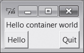
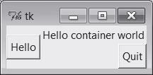
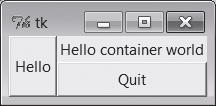
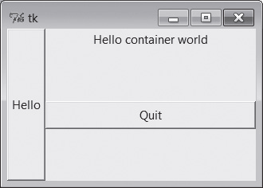
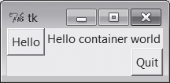

# PyGame

Напишем к нашему проекту (игре) графический интерфейс (GUI).

Есть много библиотек для создания GUI на python: PyQt (сложная, много может), PyGtk (тоже кроссплатформенная), tkinter (проще).

Для создания GUI игр тоже есть специальные библиотеки, например PyGame и ее упрощение для детей PyGame Zero

## Ссылки

* [pygame-zero](https://pygame-zero.readthedocs.io/en/stable/index.html)
  * [UNO](https://github.com/bennuttall/uno) - игра UNO на pygame-zero
* [PyGame Tutorial](https://www.pygame.org/wiki/tutorials)
   * [примеры игр](http://www.pygame.org/docs/ref/examples.html)
   * [http://openbookproject.net/thinkcs/python/english3e/pygame.html](http://openbookproject.net/thinkcs/python/english3e/pygame.html)
   * [OOP PyGame Tutorial](http://pygametutorials.wikidot.com/tutorials-basic)
* [https://www.python-course.eu/python_tkinter.php](https://www.python-course.eu/python_tkinter.php) - tkinter tutorial
   * [OOP tkinter tutorial](https://python-textbok.readthedocs.io/en/1.0/Introduction_to_GUI_Programming.html)
   * [https://tkdocs.com/tutorial/index.html](https://tkdocs.com/tutorial/index.html)
   * [http://infohost.nmt.edu/tcc/help/pubs/tkinter/tkinter.pdf] - неплохая документация, но по старому Tkinker.
   * Саммерфилд, глава 13. Введение в программирование графического интерфейса
   * Лутц Программирование на Python, главы 7-11.
   * Sammerfield, Pithon in Practice. Chapter 7 Graphical User Interface with Python and Tkinker

## Основные концепции GUI на примере tkinter

[https://docs.python.org/3/library/tk.html](https://docs.python.org/3/library/tk.html) - документация

* Входит в стандартную поставку.
* Небольшой размер.
* Поставляется вместе с IDLE

Внимание, в Windows файлы *.pyw запускаются программой pythonw.exe, а не python.exe, поэтому при запуске не будет консоли. В Linux разницы в расширениях нет.

Жизненный цикл консольной программы и программы с GUI. Рис 13.1 Саммерфилд

### Event-Listener

Для общения составляющих GUI между собой используется модель Event (событие) - Listener (подписчик).

Любое действие с GUI порождает событие (event). Например, нажатие Shift на клавиатуре, движение мыши или нажатие ее кнопки. Его получают те части GUI, которые подписались (слушают) это событие. Много разных частей могут услышать 1 событие. Разные части могут по-разному отреагировать на одно и то же событие.

### Hello, world!

Взято из тьюториала https://www.python-course.eu/tkinter_labels.php

Напишем простейшую программу с GUI на tkinter.

```python
import tkinter as tk

# if you are still working under a Python 2 version, 
# comment out the previous line and uncomment the following line
# import Tkinter as tk

root = tk.Tk()                              # делаем окно

w = tk.Label(root, text="Hello Tkinter!")   # в это окно добавляем надпись (Label)
w.pack()                                    # окно изменяется по размеру добавленного виджета

root.mainloop()                             # цикл обработки событий
```
Linux, Gnome


Windows:


Окно декорируется (выглядит) согласно оконному менеджеру или стилю, принятому в операционной системе.

В Windows или на Mac это окно будет выглядеть, как принято выглядеть окнам в Windows или на Mac.

Термины: *control*, *wiget* - элемент GUI.

### Label - надпись (изображение).

Добавим заранее приготовленное изображение в виде логотипа python как Label.

```python
import tkinter as tk

root = tk.Tk()
logo = tk.PhotoImage(file="python_logo_small.gif")

w1 = tk.Label(root, image=logo).pack(side="right")

explanation = """At present, only GIF and PPM/PGM
formats are supported, but an interface 
exists to allow additional image file
formats to be added easily."""

w2 = tk.Label(root, 
              justify=tk.LEFT,
              padx = 10, 
              text=explanation).pack(side="left")
root.mainloop()
```

*justify* - выравнивание. LEFT, RIGHT, CENTER (по умолчанию).

*padx* - дополнительный горизонтальный отступ вокруг w2. По умолчанию отступ 1. 

*pady* - вертикальный отступ.

Получим 


**Если хотим написать текст поверх картинки, указываем и картинку, и текст в одной и той же Label**


**Внимание! Необходимо хранить ссылку на картинку, чтобы она была показана.**

```python
import tkinter as tk

root = tk.Tk()
logo = tk.PhotoImage(file="python_logo_small.gif")

explanation = """At present, only GIF and PPM/PGM
formats are supported, but an interface 
exists to allow additional image file
formats to be added easily."""

w = tk.Label(root, 
             compound = tk.CENTER,
             text=explanation, 
             image=logo).pack(side="right")

root.mainloop()
```

** Шрифт и цвет **


```python
import tkinter as tk

root = tk.Tk()
tk.Label(root, 
		 text="Red Text in Times Font",
		 fg = "red",
		 font = "Times").pack()
tk.Label(root, 
		 text="Green Text in Helvetica Font",
		 fg = "light green",
		 bg = "dark green",
		 font = "Helvetica 16 bold italic").pack()
tk.Label(root, 
		 text="Blue Text in Verdana bold",
		 fg = "blue",
		 bg = "yellow",
		 font = "Verdana 10 bold").pack()

root.mainloop()
```

** Динамическое изменение Label по таймеру**


```python
import tkinter as tk

counter = 0 
def counter_label(label):
  def count():
    global counter
    counter += 1
    label.config(text=str(counter))
    label.after(1000, count)
  count()
 
 
root = tk.Tk()
root.title("Counting Seconds")
label = tk.Label(root, fg="green")
label.pack()
counter_label(label)
button = tk.Button(root, text='Stop', width=25, command=root.destroy)
button.pack()
root.mainloop()
```

### Список widget (не полный)

* **Frame** - виджет-контейнер, который располагается внутри окна со своей границей и цветом фона. Используется для группировки других виджетов в layout.
* **Toplevel** - отдельное окно.
* **Canvas** - рисовать тут! Можно сделать интерактивным. Основа для создания своих уникальных виджетов.
* **Text** - показ и редактирование форматированного текста, может быть встроены изображения.
* **Button** - кнопка.
* **Label** - надпись или изображение, обычно не интерактивные.
* **Message** - большая надпись, которая может быть wrapped. Похожа на Label.
* **Scrollbar**
* **Checkbutton**, **Radiobutton**, **Listbox**, **Entry** и **Scale** - разные типы виджетов для ввода информации.
* **Menu** и **Menubutton** - создаем меню

## Использование tkinter в ООП стиле

https://python-textbok.readthedocs.io/en/1.0/Introduction_to_GUI_Programming.htm

Напишем GUI с классами, используя библиотеку tkinter.

Пока не будем использовать наследование, обойдемся композицией. Окно состоит из надписи и двух кнопок.

Добавим к Label (надпись) еще и Button (кнопку). По нажатию на кнопку greet_button вызывается метод self.greet, который печатает "Greetings!".

Заметьте как связана кнопка close_button и закрытие всего окна.

```python
from tkinter import Tk, Label, Button

class MyFirstGUI:
    def __init__(self, master):
        self.master = master
        master.title("A simple GUI")

        self.label = Label(master, text="This is our first GUI!")
        self.label.pack()

        self.greet_button = Button(master, text="Greet", command=self.greet)
        self.greet_button.pack()

        self.close_button = Button(master, text="Close", command=master.quit)
        self.close_button.pack()

    def greet(self):
        print("Greetings!")

root = Tk()
my_gui = MyFirstGUI(root)
root.mainloop()
```

## Layout Manager - управление располжением виджетов (pack, grid, place)

### pack()

Можно положиться на метод **pack()**, который упакует виджеты один за другим в родительский контейнер, сверху вниз. Удобно для простейших окон.

Можно указать в pack параметр **side**. Чуть более сложное расположение виджетов. Но окно еще простое.

```python
from tkinter import LEFT, RIGHT

# (...)

self.label.pack()
self.greet_button.pack(side=LEFT)
self.close_button.pack(side=RIGHT)
```
* **expand=YES** - занять виджетом все свободное пространство в родительском контейнере, не занятое другими виджетами
* **fill** ('x', 'y', 'both', 'none') - занять виджетом все пространство по оси х, y, обоим осям, ни по каким осям.
* **ipadx**, **ipady** - внутренние отступы по х и у координатам с каждой стороны виджета
* **padx**, **pady** - внешние отступы по х и у координатам с каждой стороны виджета
* **side** ('left', 'right', 'top', 'bottom') - к какой части родительского виджета надо прикрепить данный виджет.
* **anchor** ('CENTER' + 'N', 'S', 'W', 'E' и их сочетания вида 'NE') - к в какой части выделенной области нужно расположить виджет (см. side для grid())

Дополнительная информация (пропустить при первом чтении):

**При изменении размеров окна в *меньшую* сторону первым исчезнет последний добавленный виджет.** Так что порядок добавления виджетов имеет значение.

Порядок прикрепления имеет значение и при распределения занимаемой области:
1. Компоновщик начинает с пустого доступного пространства родительского контейнера (весь фрейм или окно верхнего уровня)
2. Когда прикрепляем виджет к краю (side), то ему отдается весь запрашиваемый край в оставшемся пустом пространстве и пустое пространство сокращается.
3. Последующие виджеты получают то, что осталось от края после добавления предыдущих виджетов.
4. После того, как виджетам было отдано все пустое пространство, *expand* делит оставшееся пространство, а *fill* и *anchor* растягивают и устанавливают виджеты внутри выделенной им области.

Как результат:



Выглядят одинаково, но во втором случае при черезмерном сжатии сначала исчезает метка, потом кнопки.
```python
Label(win, text='Hello container world').pack(side=TOP) 
Button(win, text='Hello', command=greeting).pack(side=LEFT)
Button(win, text='Quit', command=win.quit).pack(side=RIGHT)
```
и 
```python
Button(win, text='Hello', command=greeting).pack(side=LEFT)
Button(win, text='Quit', command=win.quit).pack(side=RIGHT)
Label(win, text='Hello container world').pack(side=TOP) 
```

Тут метку создали (в коде!) между кнопок:


```python
Button(win, text='Hello', command=greeting).pack(side=LEFT)
Label(win, text='Hello container world').pack(side=TOP)         # я размещаюсь второй
Button(win, text='Quit', command=win.quit).pack(side=RIGHT)
```

Добавим expand и fill



```python
Button(win, text='Hello', command=greeting).pack(side=LEFT,fill=Y)
Label(win, text='Hello container world').pack(side=TOP)
Button(win, text='Quit', command=win.quit).pack(side=RIGHT, expand=YES,fill=X)
```
Чтобы при увеличении окна увеличивались все лежащие в нем компоненты, нужно сделать их контейнер расширяемым.

**Виджеты расширяются за пределы своего начального положения, только если расширяются все их родители**.

```python
win = Frame()
win.pack(side=TOP, expand=YES, fill=BOTH)
Button(win, text='Hello', command=greeting).pack(side=LEFT, fill=Y)
Label(win, text='Hello container world').pack(side=TOP)
Button(win, text='Quit', command=win.quit).pack(side=RIGHT, expand=YES, fill=X)
```


Добавим anchor вместо растягивания:

```python
Button(win, text=’Hello’, command=greeting).pack(side=LEFT, anchor=N)
Label(win, text=’Hello container world’).pack(side=TOP)
Button(win, text=’Quit’, command=win.quit).pack(side=RIGHT)
```



### grid()

Для сложных окон используйте **grid()**.

```python
from tkinter import W

# (...)

self.label.grid(columnspan=2, sticky=W) # строка 0, занимает 2 столбца, выравнивание W ( left-aligned)
self.greet_button.grid(row=1)           # строка 1, столбец 0
self.close_button.grid(row=1, column=1) # строка 1, столбец 1
```

Строка по умолчанию - первая свободная строка. Столбец по умолчанию 0.

Выравнивание в параметре **sticky** идет по сторонам света: N, S, W, E.

По умолчанию выравнивание по центру (по горизонтали и по вертикали).

W+E означает "растянуть слева направо".

Можно указать комбинацию NE, SW и так далее.

Кроме columnspan есть rowspan (на скольких столбцах или строках расположен виджет).

*Не смешивайте в одном контейнере pack и grid! Положите несколько виджетов в разные Frame и компонуйте дальше эти Frame другим layout manager.*

**place()** - геометрический layout manager. Быть может удобнее будет применять его.

https://www.tutorialspoint.com/python/tk_place.htm

## Custom Events

* **Event** - событие (объект)
* **event handler** - обработчик событий  (функция)

Рассмотрим изменение примера, где Label меняет свой текст по клику мыши.

```python
from tkinter import Tk, Label, Button, StringVar

class MyFirstGUI:
    LABEL_TEXT = [
        "This is our first GUI!",
        "Actually, this is our second GUI.",
        "We made it more interesting...",
        "...by making this label interactive.",
        "Go on, click on it again.",
    ]
    def __init__(self, master):
        self.master = master
        master.title("A simple GUI")

        self.label_index = 0
        self.label_text = StringVar()
        self.label_text.set(self.LABEL_TEXT[self.label_index])
        self.label = Label(master, textvariable=self.label_text)
        self.label.bind("<Button-1>", self.cycle_label_text) # свяжем label и метод cycle_label_text
        self.label.pack()

        self.greet_button = Button(master, text="Greet", command=self.greet)
        self.greet_button.pack()

        self.close_button = Button(master, text="Close", command=master.quit)
        self.close_button.pack()

    def greet(self):
        print("Greetings!")

    def cycle_label_text(self, event):
        self.label_index += 1
        self.label_index %= len(self.LABEL_TEXT) # wrap around
        self.label_text.set(self.LABEL_TEXT[self.label_index])

root = Tk()
my_gui = MyFirstGUI(root)
root.mainloop()
```

Ранее мы только связывали функцию обработчик событий (greet) с событиями, которые уже определены в tkinter по умолчанию. Класс Button (кнопка) уже знает о клике на кнопку, так как клик на кнопке - ожидаемая часть поведения этой кнопки. 

Однако, мы не ограничены этими определенными событиями и можем заставить виджет слушать другие события и связать с ними функции-обработчики, используя метод **bind()**, который есть в каждом классе виджетов.

Событие однозначно идентифицируются по имени последовательности в виде строки на мини-языке, который не является специфичным для python. Вот несколько примеров обычных событий:

https://www.python-course.eu/tkinter_events_binds.php

* События "&lt;Button-1&gt;", "&lt;Button-2&gt;" и "&lt;Button-3&gt;" сигнализируют, что была нажата определенная кнопка мыши, когда курсор был над виджетом. 
   * Button-1 - левая кнопка мыши;
   * Button-2 - средняя кнопка мыши; - ее может и не быть!
   * Button-3 - правая кнопка мыши;
* "&lt;ButtonRelease-1&gt;" - левая кнопка мыши была ОТПУЩЕНА.
* "&lt;B1-Motion&gt;" - мышь перемещалась при нажатой левой кнопке (для других кнопок используем B2 и B3).
* "&lt;Enter&gt;" и "&lt;Leave&gt;" - курсор мыши вошел или покинул виджет.
* "&lt;Key&gt;" - означает, что была нажата *любая* кнопка на клавиатуре. Можно подписаться на нажатие определенной кнопки, например, "&lt;Return&gt;" (the enter key) или комбинацию кнопок, например,  "&lt;Shift-Up&gt;" (shift-up-arrow). Нажатие кнопок большинства печатаемых символов пишется как просто символ, без скобок; например, нажатие кнопки а это просто "a".
* "&lt;Configure&gt;" - у виджета изменился размер.

Обновление текста метки немного запутано - мы не можем просто обновить текст, используя обычную строку Python. Вместо этого мы должны предоставить метке специальный объект **StringVar** строковой переменной tkinter и установить новое значение для объекта всякий раз, когда мы хотим, чтобы текст в метке изменился.

Заметьте, что обработчику событий cycle_label_text(self, event) передается объект event, в котором описана дополнительная информация о событии. 

Можно назначит один и тот же обработчик на разные события.

## Калькулятор

Напишем калькулятор, который умеет только складывать и вычитать введенные числа. Кнопка reset должна обнулять результат.

Если введены плохие данные, то нужно научиться проверять данные и реагировать на плохой ввод.

```python
from tkinter import Tk, Label, Button, Entry, IntVar, END, W, E

class Calculator:

    def __init__(self, master):
        self.master = master
        master.title("Calculator")

        self.total = 0
        self.entered_number = 0

        self.total_label_text = IntVar()
        self.total_label_text.set(self.total)
        self.total_label = Label(master, textvariable=self.total_label_text)

        self.label = Label(master, text="Total:")

        vcmd = master.register(self.validate) # we have to wrap the command
        self.entry = Entry(master, validate="key", validatecommand=(vcmd, '%P'))

        self.add_button = Button(master, text="+", command=lambda: self.update("add"))
        self.subtract_button = Button(master, text="-", command=lambda: self.update("subtract"))
        self.reset_button = Button(master, text="Reset", command=lambda: self.update("reset"))

        # LAYOUT

        self.label.grid(row=0, column=0, sticky=W)
        self.total_label.grid(row=0, column=1, columnspan=2, sticky=E)

        self.entry.grid(row=1, column=0, columnspan=3, sticky=W+E)

        self.add_button.grid(row=2, column=0)
        self.subtract_button.grid(row=2, column=1)
        self.reset_button.grid(row=2, column=2, sticky=W+E)

    def validate(self, new_text):
        if not new_text: # the field is being cleared
            self.entered_number = 0
            return True

        try:
            self.entered_number = int(new_text)
            return True
        except ValueError:
            return False

    def update(self, method):
        if method == "add":
            self.total += self.entered_number
        elif method == "subtract":
            self.total -= self.entered_number
        else: # reset
            self.total = 0

        self.total_label_text.set(self.total)
        self.entry.delete(0, END)

root = Tk()
my_gui = Calculator(root)
root.mainloop()
```

## ООП с наследованием

Напишем программу в настоящем ООП стиле с наследованием.

Будем наследоваться от класса, который представляет отдельное окно.

```python
import tkinter as tk

class Application(tk.Frame):
    def __init__(self, master=None):
        super().__init__(master)
        self.master = master
        self.pack()
        self.create_widgets()

    def create_widgets(self):
        self.hi_there = tk.Button(self)
        self.hi_there["text"] = "Hello World\n(click me)"
        self.hi_there["command"] = self.say_hi
        self.hi_there.pack(side="top")

        self.quit = tk.Button(self, text="QUIT", fg="red",
                              command=self.master.destroy)
        self.quit.pack(side="bottom")

    def say_hi(self):
        print("hi there, everyone!")

root = tk.Tk()
app = Application(master=root)
app.mainloop()
```

tkinter и tkinter.ttk содержат наборы классов-виджетов. tkinter простые, а tkinter.ttk - с использованием тем. Учим простые, наборы в основном совпадают, но есть уникальные виджеты в обоих наборах.

От кого наследовать главное окно приложения? tkinter.Toplevel или tkinter.ttk.Frame.

# Лутц, Программирование на Python, главы 7-11

## Добавление пользовательских обработчиков событий (event handler)

### lambda-функции
```python
# lambda-выражение генерирует функцию, но содержит всего лишь выражение
widget = tk.Button(None, 
    text='Hello event world',
    command=(lambda: print('Hello lambda world') or sys.exit()) )
```
Хитрость: в lambda-функции может быть только 1 выражение, поэтому мы пишем  print и exit в одно выражение, связывая их через **or**.

### Отложенные вызовы

Иногда нужно в обработчик событий передать дополнительные данные.

Обычно функции как обработчики событий указываются без аргументов:
```python
def hi():
    print('Hi!')
    
tk.Button(text='Greetings', command=hi)
```

Что делать, если нужно передать в функцию-обработчик аргумент? 

```python
def hi(name):
    print(f'Hi, {name}!')

tk.Button(text='Greetings', command=hi('dear students'))
```
Ошибка! Функция hi будет вызвана не в момент нажатия кнопки, а при ее создании.

Как исправить?

Вариант 1: пишем функцию-обертку и вызываем обертку.

```python
def hi(name):
    print(f'Hi, {name}!')

def greeting():
    hi('dear students')
    
tk.Button(text='Greetings', command=greeting)
```

Вариант 2: отложенный вызов.

```python
def hi(name):
    print(f'Hi, {name}!')

tk.Button(text='Greetings', command=lambda: hi('dear students'))
```
Этот вариант вы уже видели в калькуляторе.

Повторим еще раз:

Хорошо:
```python
def handler(A, B): # обычно вызывается без аргументов
    ...использование A и B...
    
X = 42
Button(text='ni', command=(lambda: handler(X, 'spam'))) # lambda добавляет аргументы
```

Цитата:
*Вызов фактического обработчика откладывается, благодаря чему мы получаем возможность добавлять необходимые аргументы. В данном случае значение глобальной переменной X и строка "spam" будут переданы в аргументах A и B даже при том, что библиотека tkinter вызывает функции обратного вызова без аргументов. Таким образом, инструкция lambda может использоваться для отображения вызова без аргументов в вызов с аргументами, которые поставляются самим lambda-выражением.*

Плохо:
```python
def handler(name):
    print(name)
    
Button(command=handler('spam')) # ОШИБКА: обработчик будет вызван немедленно!
```
из "плохо" делаем "хорошо" без lambda:
```python
def handler(name):
    print(name)
def temp():
    handler('spam')
Button(command=temp) # OK: ссылка на функцию, а не ее вызов
```

"Слишком хорошо":
```python
def handler(name):
    print(name)
def temp():
    handler('spam')
    
Button(command=(lambda: temp())) # БЕССМЫСЛЕННО: добавляет лишний вызов!
```
### Проблемы с областями видимости для обработчиков

Как передавать данные в функции-обработчики?

#### Глобальные переменные

Тогда можно написать функцию handler без аргументов, а X и name сделать глобальными переменными.

Минус - неочевидный код управления значениями этих переменных (неудобно понимать и изменять).

#### Передача значений из объемлющей области видимости при помощи аргументов со значением по умолчанию

Х теперь не глобальная, а лежит в объемлющей области видимости. Все работает, как мы хотим:

```python
def handler(A, B):
    ...использование A и B...
def makegui():
    X = 42
    Button(text='ni', command=(lambda: handler(X, 'spam'))) # запоминает X
    
makegui()
mainloop() # в этой точке область видимости функции makegui прекратила существование
```

Можно передать явно значение Х при вызове обработчика, сделав его значением по умолчанию.

Значения по умолчанию вычисляются при *создании*, а не при *вызове* функции. Поэтому тут явно гарантируется значение 42 (которое вычисляеся при выполнении lambda-выражения). Позже библиотекой будет вызвана lambda-функция без аргументов, поэтому все ее аргументы получат значения по умолчанию.
```python
def handler(A, B):
    ...использование A и B...
def makegui():
    X = 42
    Button(text='ni', command=(lambda X=X: handler(X, 'spam'))) # запоминает X
```

#### Передача значений из объемлющей области видимости с помощью автоматических ссылок

Оба примера выше в результате делают одно и то же. Но внутри lambda-выражения ссылки на переменную из объемлющей области видимости разрешаются в момет *вызова* этой функции, а не в момет ее *создания*.

С одной стороны получаем плюс, можно написать значение переменной после написания lambda-выражения.

Переменная *до* lambda-выражения. Все работает, как ожидается.
```python
def simple():
    spam = 'ni'
    def action():
        print(spam)  # ссылка на переменную в объемлющей функции
    return action

act = simple()       # создать и вернуть вложенную функцию
act()                # затем вызвать ее: выведет 'ni'
```
Переменная *после* lambda-выражения. Тоже работает, потому что поиск значения переменной начинается только при ее вызове.
```python
def simple():
    def action():
        print(spam)  # ссылка на переменную в объемлющей функции
    spam = 'ni'
    return action

act = simple()       # создать и вернуть вложенную функцию
act()                # затем вызвать ее: выведет 'ni'
```
Видно, что в момент создания вложенной функции action переменная spam даже не была определена. Разрешение имени spam происходит во время *вызова* функции action.

То же справедливо и для lambda-выражений.

```python
def weird():
    spam = 42
    return (lambda: spam * 2) # запомнит ссылку на spam в объемлющей области видимости
    
act = weird()
print(act())                  # выведет 84
```
и это тоже работает:
```python
def weird():
    tmp = (lambda: spam * 2) # запомнит ссылку на spam, даже при том, что здесь она еще не установлена
    spam = 42
    return tmp
    
act = weird()
print(act())                  # выведет 84
```
Чуть подробнее о связывании:
```python
def weird():
    spam = 42
    handler = (lambda: spam * 2) # функция не сохраняет текущее значение 42
    spam = 50
    print(handler()) # выведет 100: поиск spam выполняется именно сейчас
    spam = 60
    print(handler()) # выведет 120: поиск spam снова выполняется именно сейчас

weird()
```
В GUI часто виджеты (и их обработчики) создаются в цикле. При этом можем получить:
```python
def odd():
    funcs = []
    for c in 'abcdefg':
        funcs.append((lambda: c))   # поиск переменной c будет выполнен позднее
    return funcs                    # не сохраняет текущее значение c
    
for func in odd():
    print(func(), end=' ')          # Опа!: выведет 7 символов g, а не a,b,c,... !
```
В этом случае поможет передача значения по умолчанию:
```python
def odd():
    funcs = []
    for c in 'abcdefg':
        funcs.append((lambda c=c: c)) # значение по умолчанию вычисляется немедленно 
                                      # и запоминается текущее значение
    return funcs
    
for func in odd():
    print(func(), end=' ')            # ОК: a b c ...
```

То же правило действует, если объемлющей областью является модуль, а не другая функция:

```python
funcs = []                        # объемлющая область видимости - модуль
for c in 'abcdefg':               # запоминаем текущее значение c, 
    funcs.append((lambda c=c: c)) # иначе получим 7 g

for func in odd():
    print(func(), end=' ')        # ОК: a b c ...
```

Вывод: **используем ссылки на переменные в объемлющей функции видимости, если переменные не будут изменяться, иначе передаем их значениями по умолчанию**

Использовать ссылку на внешнюю переменную цикла внутри вложенной функции неразумно. Тогда передаем значение этой переменной как значение по умолчанию.

#### Связанные методы класса как обработчики событий

```python
import sys
from tkinter import *
class HelloClass:
    def __init__(self):
        widget = Button(text='Hello event world', command=self.quit)
        widget.pack()
        
    def quit(self):
        print('Hello class method world')   # self.quit - связанный метод
        sys.exit()                          # хранит пару self+quit

HelloClass()
mainloop()
```
Хоть вызывается метод quit без аргументов, но на самом деле он получает аргумент self.

Если мы заходим вызвать метод по имени класса command=HelloClass.quit, то произойдет ошибка "quit() missing 1 required positional argument: 'self'"

Заметим, что фактически в методе quit мы нигде не пользовались, что это метод объекта класса (т.е. не использовали self). Если мы напишем обработчик как статический метод quit2, то его можно будет вызвать и по self.quit2 и по имени класса HelloClass.quit2.

Перепишем handler с X=42 и name='spam' в виде класса:
```python
import sys
from tkinter import *
class HelloClass:
    def __init__(self):
        self.X = 42
        self.name = 'spam'
        Button(text='Hello', command=self.handler)
        widget.pack()
        
    def handler(self):
        # используем self.X и self.name

HelloClass()
mainloop()
```

#### Объекты вызываемых классов как обработчики событий

Объект класса может вызываться как функция, если у класса переопределен метод \_\_call\_\_.

```python
import sys
from tkinter import *
class HelloCallable:
    def __init__(self):                 # __init__ вызывается при создании объекта
        self.msg = 'Hello __call__ world'
    def __call__(self):
        print(self.msg)                 # __call__ вызывается при попытке обратиться
        sys.exit() # к объекту класса как к функции
        
widget = Button(None, text='Hello event world', command=HelloCallable())
widget.pack()
widget.mainloop()
```
Экземпляр класса, зарегистрированный в command, может вызываться как обычная функция. Python вызовет его метод \_\_call\_\_.

#### Связывание событий

Покажем, как нажатие на кнопку можно связать не через параметр command, а через функцию **bind()**

```python
import sys
from tkinter import *
def hello(event):               # одиночный щелчок левой кнопкой
    print('Press twice to exit')
def quit(event):                # двойной щелчок левой кнопкой (event дает виджет, координаты и т.д.)
    print('Hello, I must be going...') 
    sys.exit()
    
widget = Button(None, text='Hello event world')
widget.pack()
widget.bind('<Button-1>', hello)    # привязать обработчик щелчка
widget.bind('<Double-1>', quit)     # привязать обработчик двойного щелчка
widget.mainloop()
```

