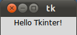
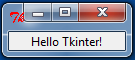
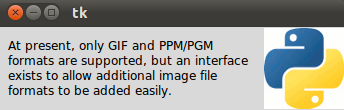
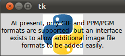
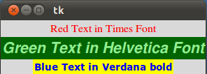
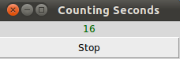

# PyGame

Напишем к нашему проекту (игре) графический интерфейс (GUI).

Есть много библиотек для создания GUI на python: PyQt (сложная, много может), PyGtk (тоже кроссплатформенная), tkinter (проще).

Для создания GUI игр тоже есть специальные библиотеки, например PyGame и ее упрощение для детей PyGame Zero

## Ссылки

* [pygame-zero](https://pygame-zero.readthedocs.io/en/stable/index.html)
  * [UNO](https://github.com/bennuttall/uno) - игра UNO на pygame-zero
* [PyGame Tutorial](https://www.pygame.org/wiki/tutorials)
   * [примеры игр](http://www.pygame.org/docs/ref/examples.html)
   * [http://openbookproject.net/thinkcs/python/english3e/pygame.html](http://openbookproject.net/thinkcs/python/english3e/pygame.html)
   * [OOP PyGame Tutorial](http://pygametutorials.wikidot.com/tutorials-basic)
* [https://www.python-course.eu/python_tkinter.php](https://www.python-course.eu/python_tkinter.php) - tkinter tutorial
   * [OOP tkinter tutorial](https://python-textbok.readthedocs.io/en/1.0/Introduction_to_GUI_Programming.html)
   * [https://tkdocs.com/tutorial/index.html](https://tkdocs.com/tutorial/index.html)
   * [http://infohost.nmt.edu/tcc/help/pubs/tkinter/tkinter.pdf] - неплохая документация, но по старому Tkinker.
   * Саммерфилд, глава 13. Введение в программирование графического интерфейса
   * Лутц Программирование на Python, стр 89 и далее
   * Sammerfield, Pithon in Practice. Chapter 7 Graphical User Interface with Python and Tkinker

## Основные концепции GUI на примере tkinter

[https://docs.python.org/3/library/tk.html](https://docs.python.org/3/library/tk.html) - документация

* Входит в стандартную поставку.
* Небольшой размер.
* Поставляется вместе с IDLE

Внимание, в Windows файлы *.pyw запускаются программой pythonw.exe, а не python.exe, поэтому при запуске не будет консоли. В Linux разницы в расширениях нет.

Жизненный цикл консольной программы и программы с GUI. Рис 13.1 Саммерфилд

### Event-Listener

Для общения составляющих GUI между собой используется модель Event (событие) - Listener (подписчик).

Любое действие с GUI порождает событие (event). Например, нажатие Shift на клавиатуре, движение мыши или нажатие ее кнопки. Его получают те части GUI, которые подписались (слушают) это событие. Много разных частей могут услышать 1 событие. Разные части могут по-разному отреагировать на одно и то же событие.

### Hello, world!

Взято из тьюториала https://www.python-course.eu/tkinter_labels.php

Напишем простейшую программу с GUI на tkinter.

```python
import tkinter as tk

# if you are still working under a Python 2 version, 
# comment out the previous line and uncomment the following line
# import Tkinter as tk

root = tk.Tk()                              # делаем окно

w = tk.Label(root, text="Hello Tkinter!")   # в это окно добавляем надпись (Label)
w.pack()                                    # окно изменяется по размеру добавленного виджета

root.mainloop()                             # цикл обработки событий
```
Linux, Gnome


Windows:


Окно декорируется (выглядит) согласно оконному менеджеру или стилю, принятому в операционной системе.

В Windows или на Mac это окно будет выглядеть, как принято выглядеть окнам в Windows или на Mac.

Термины: *control*, *wiget* - элемент GUI.

### Label - надпись (изображение).

Добавим заранее приготовленное изображение в виде логотипа python как Label.

```python
import tkinter as tk

root = tk.Tk()
logo = tk.PhotoImage(file="python_logo_small.gif")

w1 = tk.Label(root, image=logo).pack(side="right")

explanation = """At present, only GIF and PPM/PGM
formats are supported, but an interface 
exists to allow additional image file
formats to be added easily."""

w2 = tk.Label(root, 
              justify=tk.LEFT,
              padx = 10, 
              text=explanation).pack(side="left")
root.mainloop()
```

*justify* - выравнивание. LEFT, RIGHT, CENTER (по умолчанию).

*padx* - дополнительный горизонтальный отступ вокруг w2. По умолчанию отступ 1. 

*pady* - вертикальный отступ.

Получим 



**Если хотим написать текст поверх картинки, указываем и картинку, и текст в одной и той же Label**



```python
import tkinter as tk

root = tk.Tk()
logo = tk.PhotoImage(file="python_logo_small.gif")

explanation = """At present, only GIF and PPM/PGM
formats are supported, but an interface 
exists to allow additional image file
formats to be added easily."""

w = tk.Label(root, 
             compound = tk.CENTER,
             text=explanation, 
             image=logo).pack(side="right")

root.mainloop()
```

** Шрифт и цвет **



```python
import tkinter as tk

root = tk.Tk()
tk.Label(root, 
		 text="Red Text in Times Font",
		 fg = "red",
		 font = "Times").pack()
tk.Label(root, 
		 text="Green Text in Helvetica Font",
		 fg = "light green",
		 bg = "dark green",
		 font = "Helvetica 16 bold italic").pack()
tk.Label(root, 
		 text="Blue Text in Verdana bold",
		 fg = "blue",
		 bg = "yellow",
		 font = "Verdana 10 bold").pack()

root.mainloop()
```

** Динамическое изменение Label по таймеру**



```python
import tkinter as tk

counter = 0 
def counter_label(label):
  def count():
    global counter
    counter += 1
    label.config(text=str(counter))
    label.after(1000, count)
  count()
 
 
root = tk.Tk()
root.title("Counting Seconds")
label = tk.Label(root, fg="green")
label.pack()
counter_label(label)
button = tk.Button(root, text='Stop', width=25, command=root.destroy)
button.pack()
root.mainloop()
```

### Список widget (не полный)

* **Frame** - виджет-контейнер, который располагается внутри окна со своей границей и цветом фона. Используется для группировки других виджетов в layout.
* **Toplevel** - отдельное окно.
* **Canvas** - рисовать тут! Можно сделать интерактивным. Основа для создания своих уникальных виджетов.
* **Text** - показ и редактирование форматированного текста, может быть встроены изображения.
* **Button** - кнопка.
* **Label** - надпись или изображение, обычно не интерактивные.
* **Message** - большая надпись, которая может быть wrapped. Похожа на Label.
* **Scrollbar**
* **Checkbutton**, **Radiobutton**, **Listbox**, **Entry** и **Scale** - разные типы виджетов для ввода информации.
* **Menu** и **Menubutton** - создаем меню

## Использование tkinter в ООП стиле

https://python-textbok.readthedocs.io/en/1.0/Introduction_to_GUI_Programming.htm

Напишем GUI с классами, используя библиотеку tkinter.

Пока не будем использовать наследование, обойдемся композицией. Окно состоит из надписи и двух кнопок.

Добавим к Label (надпись) еще и Button (кнопку). По нажатию на кнопку greet_button вызывается метод self.greet, который печатает "Greetings!".

Заметьте как связана кнопка close_button и закрытие всего окна.

```python
from tkinter import Tk, Label, Button

class MyFirstGUI:
    def __init__(self, master):
        self.master = master
        master.title("A simple GUI")

        self.label = Label(master, text="This is our first GUI!")
        self.label.pack()

        self.greet_button = Button(master, text="Greet", command=self.greet)
        self.greet_button.pack()

        self.close_button = Button(master, text="Close", command=master.quit)
        self.close_button.pack()

    def greet(self):
        print("Greetings!")

root = Tk()
my_gui = MyFirstGUI(root)
root.mainloop()
```

## Layout Manager - управление располжением виджетов (pack, grid, place)

Можно положиться на метод **pack()**, который упакует виджеты один за другим в родительский контейнер, сверху вниз. Удобно для простейших окон.

Можно указать в pack параметр **side**. Чуть более сложное расположение виджетов. Но окно еще простое.

```python
from tkinter import LEFT, RIGHT

# (...)

self.label.pack()
self.greet_button.pack(side=LEFT)
self.close_button.pack(side=RIGHT)
```

Для сложных окон используйте **grid()**.

```python
from tkinter import W

# (...)

self.label.grid(columnspan=2, sticky=W) # строка 0, занимает 2 столбца, выравнивание W ( left-aligned)
self.greet_button.grid(row=1)           # строка 1, столбец 0
self.close_button.grid(row=1, column=1) # строка 1, столбец 1
```

Строка по умолчанию - первая свободная строка. Столбец по умолчанию 0.

Выравнивание в параметре **sticky** идет по сторонам света: N, S, W, E.

По умолчанию выравнивание по центру (по горизонтали и по вертикали).

W+E означает "растянуть слева направо".

Можно указать комбинацию NE, SW и так далее.

Кроме columnspan есть rowspan (на скольких столбцах или строках расположен виджет).

*Не смешивайте в одном контейнере pack и grid! Положите несколько виджетов в разные Frame и компонуйте дальше эти Frame другим layout manager.*

**place()** - геометрический layout manager. Быть может удобнее будет применять его.

https://www.tutorialspoint.com/python/tk_place.htm

## Custom Events

* **Event** - событие (объект)
* **event handler** - обработчик событий  (функция)

Рассмотрим изменение примера, где Label меняет свой текст по клику мыши.

```python
from tkinter import Tk, Label, Button, StringVar

class MyFirstGUI:
    LABEL_TEXT = [
        "This is our first GUI!",
        "Actually, this is our second GUI.",
        "We made it more interesting...",
        "...by making this label interactive.",
        "Go on, click on it again.",
    ]
    def __init__(self, master):
        self.master = master
        master.title("A simple GUI")

        self.label_index = 0
        self.label_text = StringVar()
        self.label_text.set(self.LABEL_TEXT[self.label_index])
        self.label = Label(master, textvariable=self.label_text)
        self.label.bind("<Button-1>", self.cycle_label_text) # свяжем label и метод cycle_label_text
        self.label.pack()

        self.greet_button = Button(master, text="Greet", command=self.greet)
        self.greet_button.pack()

        self.close_button = Button(master, text="Close", command=master.quit)
        self.close_button.pack()

    def greet(self):
        print("Greetings!")

    def cycle_label_text(self, event):
        self.label_index += 1
        self.label_index %= len(self.LABEL_TEXT) # wrap around
        self.label_text.set(self.LABEL_TEXT[self.label_index])

root = Tk()
my_gui = MyFirstGUI(root)
root.mainloop()
```

Ранее мы только связывали функцию обработчик событий (greet) с событиями, которые уже определены в tkinter по умолчанию. Класс Button (кнопка) уже знает о клике на кнопку, так как клик на кнопке - ожидаемая часть поведения этой кнопки. 

Однако, мы не ограничены этими определенными событиями и можем заставить виджет слушать другие события и связать с ними функции-обработчики, используя метод **bind()**, который есть в каждом классе виджетов.

Событие однозначно идентифицируются по имени последовательности в виде строки на мини-языке, который не является специфичным для python. Вот несколько примеров обычных событий:

https://www.python-course.eu/tkinter_events_binds.php

* События "&lt;Button-1&gt;", "&lt;Button-2&gt;" и "&lt;Button-3&gt;" сигнализируют, что была нажата определенная кнопка мыши, когда курсор был над виджетом. 
   * Button-1 - левая кнопка мыши;
   * Button-2 - средняя кнопка мыши; - ее может и не быть!
   * Button-3 - правая кнопка мыши;
* "&lt;ButtonRelease-1&gt;" - левая кнопка мыши была ОТПУЩЕНА.
* "&lt;B1-Motion&gt;" - мышь перемещалась при нажатой левой кнопке (для других кнопок используем B2 и B3).
* "&lt;Enter&gt;" и "&lt;Leave&gt;" - курсор мыши вошел или покинул виджет.
* "&lt;Key&gt;" - означает, что была нажата *любая* кнопка на клавиатуре. Можно подписаться на нажатие определенной кнопки, например, "&lt;Return&gt;" (the enter key) или комбинацию кнопок, например,  "&lt;Shift-Up&gt;" (shift-up-arrow). Нажатие кнопок большинства печатаемых символов пишется как просто символ, без скобок; например, нажатие кнопки а это просто "a".
* "&lt;Configure&gt;" - у виджета изменился размер.

Обновление текста метки немного запутано - мы не можем просто обновить текст, используя обычную строку Python. Вместо этого мы должны предоставить метке специальный объект **StringVar** строковой переменной tkinter и установить новое значение для объекта всякий раз, когда мы хотим, чтобы текст в метке изменился.

Заметьте, что обработчику событий cycle_label_text(self, event) передается объект event, в котором описана дополнительная информация о событии. 

Можно назначит один и тот же обработчик на разные события.

## Калькулятор

Напишем калькулятор, который умеет только складывать и вычитать введенные числа. Кнопка reset должна обнулять результат.

Если введены плохие данные, то нужно научиться проверять данные и реагировать на плохой ввод.

```python
from tkinter import Tk, Label, Button, Entry, IntVar, END, W, E

class Calculator:

    def __init__(self, master):
        self.master = master
        master.title("Calculator")

        self.total = 0
        self.entered_number = 0

        self.total_label_text = IntVar()
        self.total_label_text.set(self.total)
        self.total_label = Label(master, textvariable=self.total_label_text)

        self.label = Label(master, text="Total:")

        vcmd = master.register(self.validate) # we have to wrap the command
        self.entry = Entry(master, validate="key", validatecommand=(vcmd, '%P'))

        self.add_button = Button(master, text="+", command=lambda: self.update("add"))
        self.subtract_button = Button(master, text="-", command=lambda: self.update("subtract"))
        self.reset_button = Button(master, text="Reset", command=lambda: self.update("reset"))

        # LAYOUT

        self.label.grid(row=0, column=0, sticky=W)
        self.total_label.grid(row=0, column=1, columnspan=2, sticky=E)

        self.entry.grid(row=1, column=0, columnspan=3, sticky=W+E)

        self.add_button.grid(row=2, column=0)
        self.subtract_button.grid(row=2, column=1)
        self.reset_button.grid(row=2, column=2, sticky=W+E)

    def validate(self, new_text):
        if not new_text: # the field is being cleared
            self.entered_number = 0
            return True

        try:
            self.entered_number = int(new_text)
            return True
        except ValueError:
            return False

    def update(self, method):
        if method == "add":
            self.total += self.entered_number
        elif method == "subtract":
            self.total -= self.entered_number
        else: # reset
            self.total = 0

        self.total_label_text.set(self.total)
        self.entry.delete(0, END)

root = Tk()
my_gui = Calculator(root)
root.mainloop()
```

## ООП с наследованием

Напишем программу в настоящем ООП стиле с наследованием.

Будем наследоваться от класса, который представляет отдельное окно.

```python
import tkinter as tk

class Application(tk.Frame):
    def __init__(self, master=None):
        super().__init__(master)
        self.master = master
        self.pack()
        self.create_widgets()

    def create_widgets(self):
        self.hi_there = tk.Button(self)
        self.hi_there["text"] = "Hello World\n(click me)"
        self.hi_there["command"] = self.say_hi
        self.hi_there.pack(side="top")

        self.quit = tk.Button(self, text="QUIT", fg="red",
                              command=self.master.destroy)
        self.quit.pack(side="bottom")

    def say_hi(self):
        print("hi there, everyone!")

root = tk.Tk()
app = Application(master=root)
app.mainloop()
```

tkinter и tkinter.ttk содержат наборы классов-виджетов. tkinter простые, а tkinter.ttk - с использованием тем. Учим простые, наборы в основном совпадают, но есть уникальные виджеты в обоих наборах.

От кого наследовать главное окно приложения? tkinter.Toplevel или tkinter.ttk.Frame.
